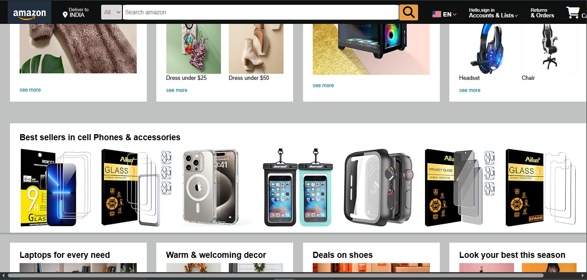

Amazon Clone 🌐
This is my first project — a simple Amazon Clone built using only HTML and CSS.
It focuses on recreating the basic structure and design of Amazon's homepage.

📌 Features
Responsive Header with Amazon Logo

Navigation Bar with Search Bar

Product Sections (Deals, Best Sellers, etc.)

Footer with basic links

Fully responsive layout (for larger screens)

🚀 Tech Stack
HTML5

CSS3

📸 Screenshots

🛠️ What I Learned
Structuring webpages with semantic HTML

Styling layouts using Flexbox and Grid

Building responsive designs

Improving my CSS skills by replicating real-world websites

📂 How to Run
Clone the repository:

bash
Copy
Edit
git clone https://github.com/thejiya04/Amazon-Clone.git
Open index.html in your browser!

🎯 Future Improvements
Add responsiveness for mobile devices

Integrate basic JavaScript for interactivity (like a working search bar)

Add login/signup UI pages

🙌 Acknowledgements
Inspired by Amazon's official website design

